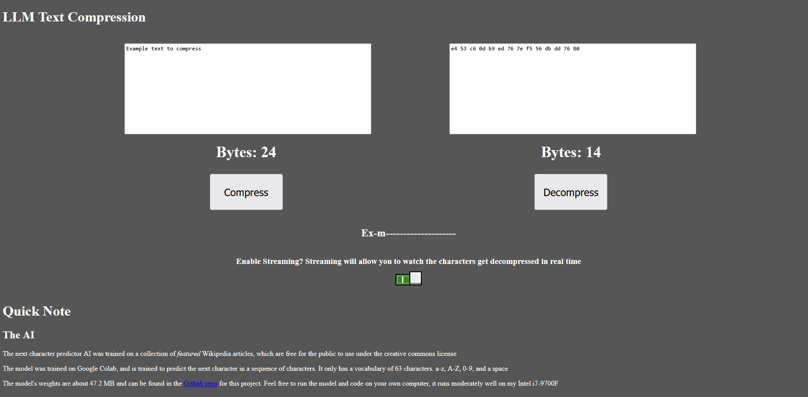

# LLM Text Compression
Text compression using an AI model to predict next characters

Try out a live demo [here](https://llm-text-compression.netlify.app/) (https://llm-text-compression.netlify.app/)

The live demo has all sorts of fun technical information and allows you to try out the compression and decompression yourself

# Quickstart
First create and enter a python venv for Python 3.11.3 and pip 26.1.2. Then `pip` install packages like `tensorflow` and `numpy`. And if you're going to run the api install `flask` and `flask-cors` on top of that
If you can I would recommend running `py ./de_compressor/fullWorkingFlow.py` | Buf if you want you can run the API via `py ./de_compressor/API.py`
And then just send requests to it. You can see some request formatting inside of `website/index.html`

# Features
- There is the LLM trainer, and wikipedia "scraper" inside of the `llm` and `scrape_data` folders respectively. I would recommend training the AI via Google Colab on a T4 GPU as it is blazingly fast 
- You have the model weights! You can mind the main model's weights inside of `llm/model.weights.h5`
- You can compress and decompress data. For an example usage look inside of `de_compressor/fullWorkingFlow.py`
- There is an API as well for the compression and decompression
- There is also a website that explains how this algorithm works, and allows you to interface with the API!

# Credits
Basically all of the code for training the model came from [this](https://www.tensorflow.org/text/tutorials/text_generation) tensorflow tutorial article. With it I would not have been able to even get this project off the ground

